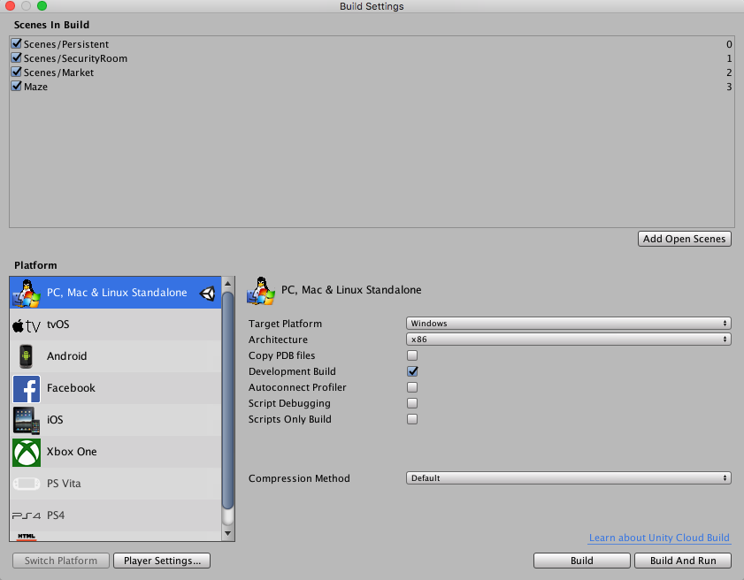

# VICER_ANDROID
 
## 소개
클라이언트가 자신의 컨트롤러와 차량을 연결하고 360영상을 Gear VR로 수신하기 위한 Application이다.

#### Application 기능
* Database와 비교하여 사용자별 메뉴화면으로 로그인
* 제작된 컨트롤러로 부터 받은 제어값을 Bluetooth 통신으로 받아 소켓서버에 전송
* 차량 제어 준비가 끝나면 Gear VR에 장착하여 차량으로부터 수신된 360도 스트리밍 영상을 송출

## 개발환경 설정 실행환경
VR 화면을 어플에서 제공해주기 위하여 XR 시장의 2/3을 차지하고 있는 Unity를 사용하여 개발하였다.</br>
Samsung Gear VR을 사용하기 위하여 핸드폰 기종은 Galaxy 시리즈를 사용한다.</br>
무선 인터넷 환경(Wi-fi) 에서 HTTP 통신, TCP/IP 소켓서버를 이용하며, Bluetooth 모듈을 이용하여 p2p 통신방식으로 컨트롤러를 제어한다.


### 유니티
* 유니티는 무료배포 버전과 Pro 버전이 있다. 본 제품에서는 기본으로 제공되는 Personal 버전을 사용하였다. 
* 최신버전의 유니티 에디터의 경우 안드로이드 sdk를 통해 모바일로 빌드하는 과정에서 호환이 되지 않는 경우가 많으므로 한 단계 아래버전인 2017 버전을 사용하였다.  
   * https://unity3d.com/kr/get-unity/download/archive?_ga=2.139035312.2061731462.1538114974-889079946.1538114974
   * 위의 링크에서 유니티 2017.4.3 버전을 설치받는다.
   
### 안드로이드 sdk
* 유니티에서 apk파일로 빌드하기 위하여 유니티 preference에 등록 해주어야 합니다.
* https://developer.android.com/studio/ 링크에서 Android studio를 설치합니다.
* 스튜디오를 실행시킨 후 SDK manager를 통해 유니티의 XR기능을 사용하기 위한 최소 API 레벨인 19이상의 플랫폼과 tool을 다운받습니다.
* 유니티의 Edit - Preferences 에 들어가 ExternalTools에서 다운로드받은 sdk의 경로를 설정 해줍니다.

### JDK
* 모바일로 빌드하기 위해 필요한 Java Development kit를 유니티에서 설정해 주어야 합니다.
* https://www.oracle.com/technetwork/java/javase/downloads/jdk8-downloads-2133151.html
* Java SE Development Kit 8u181 에서 OS에 맞는 버전을 받아 sdk와 마찬가지로 External Tools의 jdk칸에 경로를 설정 해줍니다.

## 설치
깃에 첨부된 unity 프로젝트를 다운 받아 유니티로 열어준다.
 
* 사용할 핸드폰에 컴퓨터를 연결 시켜주고 Build & run 시켜준다.


## 사용 예시

* 어플의 메뉴구성도이다. 위의 흐름대로 사용자는 사용하게 된다.
### 어플사용 흐름

유니티로 빌드 시킨 어플을 처음 실행 시키게 되면 나오는 화면이다. </br>
우선 처음 사용하는 사용자는 계정이 없으므로 회원가입을 진행하도록 한다.


회원가입 진행 후 사용자는 로그인하게 되면 고객과 운전자에 따라 각각의 서비스 창으로 넘어가게 된다.

* 자신의 차량을 운전할 운전자에게 차량 Serial Number를 전송 한다.

운전자는 자신이 제어할 차량을 확인하기 위하여 메시지로 받은 Serial Number를 입력하고 대기중인 차량이라면 Bluetooth 연결하는 화면으로 넘어갈 수 있다.

운전자는 자신의 컨트롤러와 Application을 연결하기 위하여 Bluetooth를 이용한다. </br>
연결이 성공적으로 된 뒤에 360영상을 제공받는다.


```
rlatkdgus500
````


## 라이센스
* 유니티 : https://unity3d.com/es/node/6675
* SDK : https://developer.android.com/studio/terms?hl=ko
* jdk : https://www.oracle.com/technetwork/java/javase/terms/license/index.html
